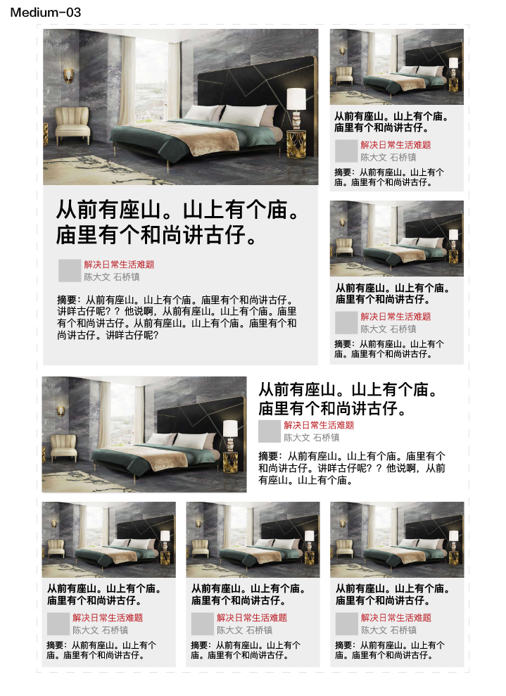

# 需求整理

用于展示文章内容摘要的模板组合

1. 在任意屏幕尺寸均可有较好的排版效果
2. 可以根据文章数量，随机地组合模板
3. 支持自定义用户组件渲染
4. 支持自定义点击动作。包括标题、摘要，用户信息，以及卡片动作的定义
5. 提供模板骨架图，供内容加载时使用

## 设计

设计中根据容器的宽度，进行了三种类型的设计。 Small 一般用于移动端，也可用于页面侧栏。Medium 一般用于笔记本，Large 一般用于大尺寸PC

### Small

### Medium

设计宽度：600px
列间距：14px，行间距：12px
摘要文字大小： 12px | 14px

### Large

设计宽度：1000px
列间距：24px，行间距：20px

